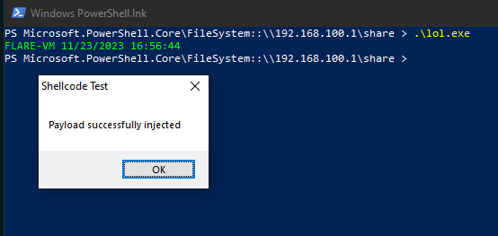

# yetAnotherNimCrypt

This project aims to help me develop my skills in malware development and AV/EDR evasion.

## Description

yetAnotherNimCrypt is a tool that automates the process of generating shellcode loaders/injectors using Nim templates.

This project aims to provide a simple and customizable way to generate shellcode loaders/injectors in Python. By utilizing Nim templates, users can easily define their own loaders and customize them to suit their specific needs.

## Features

- [x] Use custom shellcode as input
- [x] Choose output file path
- [ ] Multiple encryption techniques
- [ ] Multiple execution techniques
- [ ] Sleep time customizable
- [ ] Optionnal remote process
- [ ] Optionnal HTTP stager (encrypt the shellcode and compile the choosen template by adding a fetcher template able to download an execute the shellcode. Might use updog to serve the shellcode)

## Usage example

```bash
xl00t@linux:/home/xl00t/Desktop/Redteam $ msfvenom -p windows/x64/messagebox TEXT="Payload successfully injected" TITLE="Shellcode Test" --platform windows -a x64 -f raw -o msf.raw
No encoder specified, outputting raw payload
Payload size: 339 bytes
Saved as: msf.raw
xl00t@linux:/home/xl00t/Desktop/Redteam $ tools/yetAnotherNimCrypt/yetAnotherNimCrypt.py msf.raw --output lol.exe  
[+] Formated shellcode
[+] Shellcode template updated using technique: EnumCalendarInfo
[+] Shellcode loader compiled
xl00t@linux:/home/xl00t/Desktop/Redteam $ ll lol.exe 
-rwxr-xr-x 1 xl00t xl00t 61K Nov 23 16:41 lol.exe
xl00t@linux:/home/xl00t/Desktop/Redteam $ file lol.exe                                               
lol.exe: PE32+ executable (GUI) x86-64 (stripped to external PDB), for MS Windows, 11 sections
xl00t@linux:/home/xl00t/Desktop/Redteam $
```



## Contributing
Contributions are welcome! If you find a bug or have a suggestion for improvement, please open an issue or submit a pull request.

## License
This project is licensed under the MIT License. See the [LICENSE](https://github.com/xl00t/yetAnotherNimCrypt/blob/main/LICENSE) file for more details.